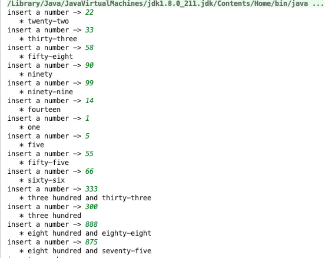

## Calculate english phrase for any number between 1 and 1000 ##

#### Request: ####
The task is to write a tool that, given any number between 1 and 1000 (inclusive), returns the grammatically correct English phrase for this number (e.g. given 111 it shows “one hundred and eleven”, given 21 it shows “twenty-one”). The code should be production ready.

#### Result: ####

